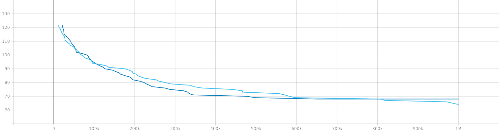
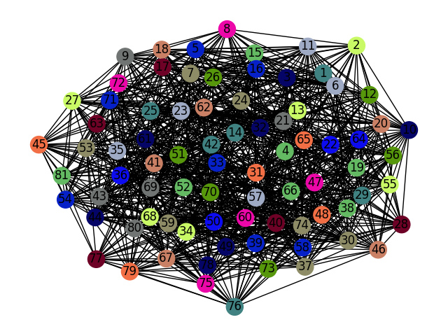

# GCP-with-Genetic-algorithm

This project aim to resolve Graph coloring problem using genetic's algorithm. This assignment is a project for Artificial Intelligence  class.

## Introduction 

Graph coloring consist to assign colors to each vertex , following certain constraints.  The minimum colors number adopted to color each node of graph is called *chromatic number*. 

## Getting started

In order to run the project you need to clone it :

``` git clone  https://github.com/borgesis95/leaf-classifier.git```

This project was developed using Python3.7 and need some external libraries. You can install them running:

``` pip3 install -r requirements.txt ```

After that you can choose from *config file (under src folder)* several options like which istance (or instances) you want to run, mutation type, crossover type ... etc. In the main folder is also avaiabile a paper which describe more accurately the operator that were developed and why. Right now is available just in Italian.

## Results 

You can see what happen on each iteration running :

``` tensorboard --logdir .\logs```



Graphic above describe how two different type of configuration works with Dimacs instances *le450_15d.col* . A the end of iteration, networkx library draw a graph with  found solution.


